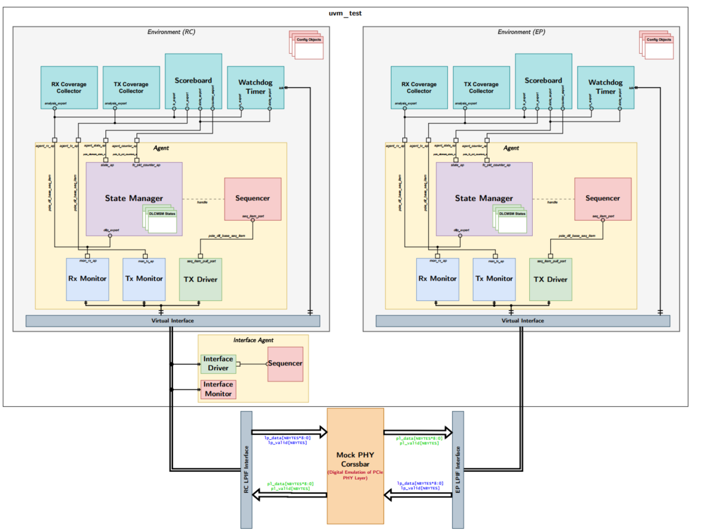

# PCIe Gen5 Data Link Layer — UVM VIP

A UVM Verification IP for the **PCIe Gen5 Data Link Layer (DLL)**, verifying the
DLCMSM (DL Control & Management State Machine) using a **Back-to-Back LPIF loopback**
with no real PHY or RTL DUT required.

---

## What it does

Drives both a **Root Complex** (`env_rc`) and an **Endpoint** (`env_ep`) through the full
DLL bring-up sequence:

```
DL_INACTIVE → DL_FEATURE_EXCH → DL_INIT_FC1 → DL_INIT_FC2 → DL_ACTIVE
```

The two environments are symmetric — same `pcie_dll_env` class, different `ROLE_RC` /
`ROLE_EP` flag. They communicate through `mock_phy_crossbar`, a zero-latency B2B module
that routes each side's `lp_*` Tx signals to the other's `pl_*` Rx signals.

---

## VIP Architecture



---

## Key components

| Component | Role |
|---|---|
| `pcie_dll_tx_drv` | Drives InitFC / Feature / TLP packets onto LPIF (`lp_*` signals) |
| `pcie_dll_rx_mon` | Reconstructs received DLLPs from `pl_*` signals; validates CRC |
| `pcie_dll_state_mgr` | Owns the DLCMSM FSM; routes received packets to the active state |
| `pcie_dll_scoreboard` | Protocol checks: ordering, credit capture, state transitions, traffic isolation |
| `pcie_dll_fc_watchdog` | Enforces the 34 µs DLLP-arrival interval (PCIe Base Spec Rev 5.0) |
| `pcie_dll_coverage` | Functional + cross coverage — DLLP types, error scenarios, FC sequencing |

---

## Built-in tests

| Test | Scenario |
|---|---|
| `test_base_with_feature` | Normal bring-up through all states (default) |
| `test_base_without_feature` | Skips `DL_FEATURE_EXCH`; goes straight to FC init |
| `test_base_corrupted_initfc` | Disordered / repeated InitFC packets |
| `test_base_error_injected` | CRC corruption, invalid DLLP type, invalid VC |
| `test_base_delayed_packets` | Back-pressure delays; exercises 34 µs watchdog |
| `test_base_zero_credits` | Zero initial FC credit advertisement |
| `test_base_drop_link` | Link-drop resilience across all FSM states |

---

## Quick start

```tcl
# Compile (from vip/ directory)
vlog ../tb/pcie_lpif_if.sv ../rtl/mock_phy_crossbar.sv pcie_dll_pkg.sv ../tb/tb_top.sv

# Run the default test
vsim -coverage -voptargs="+acc" +UVM_TESTNAME=test_base_with_feature work.tb_top \
     -do "run -all; quit -sim"
```

A ready-made `run.do` script in `vip/` wraps these steps.

---

## Documentation

| Document | Purpose |
|---|---|
| [`docs/VIP_USER_GUIDE.md`](docs/VIP_USER_GUIDE.md) | **Start here** — wiring, config objects, writing tests, error injection, coverage collection |
| [`docs/UVM_TESTBENCH_ARCHITECTURE_PLAN.md`](docs/UVM_TESTBENCH_ARCHITECTURE_PLAN.md) | **UVM Testbench Architecture Plan** — detailed component responsibilities, scoreboard checks, sequences, and environment topology |

